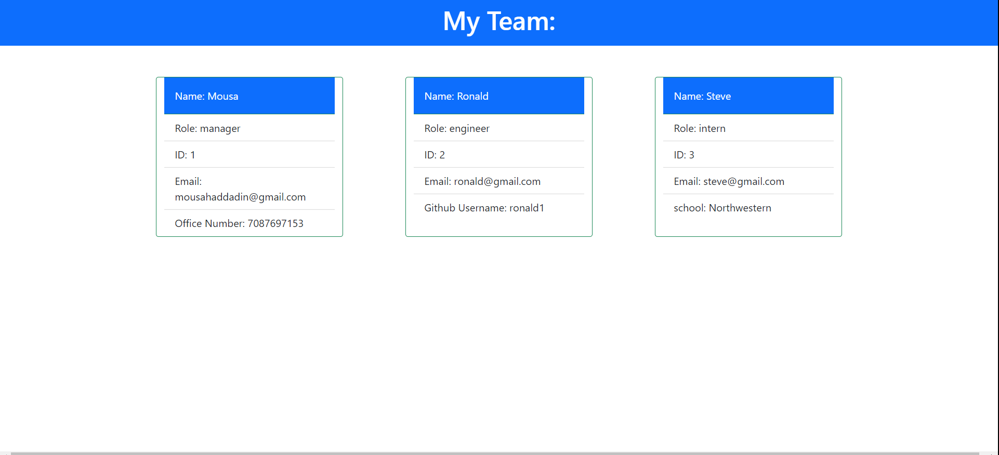

# HW10-Team-Profile-Generator

## Description

When the user starts the application they are prompted to enter the team manager’s name, employee ID, email address, and office number. Then they enter the team manager’s name, employee ID, email address, and office number. Then they are presented with a menu with the option to add an engineer or an intern or are done. When they select the engineer option then they are prompted to enter the engineer’s name, ID, email, and GitHub username, and they are taken back to the menu. Then they can select the intern option where they are prompted to enter the intern’s name, ID, email, and school, and they are taken back to the menu. If they decide to finish building their team then they select done and exit the application, and the HTML is generated.

## Installation

install npm inquirer and jest.

## Usage

Open terminal and run node index to start the application.

## Tests

Open terminal and run npm run test to run all tests.

## Links to application

-Repo Link: https://github.com/mhaddadin1/HW10-Team-Profile-Generator

-Pages Link: https://mhaddadin1.github.io/HW10-Team-Profile-Generator/

## Questions

Please email me at mousahaddadin@gmail.com

## Screenshot

